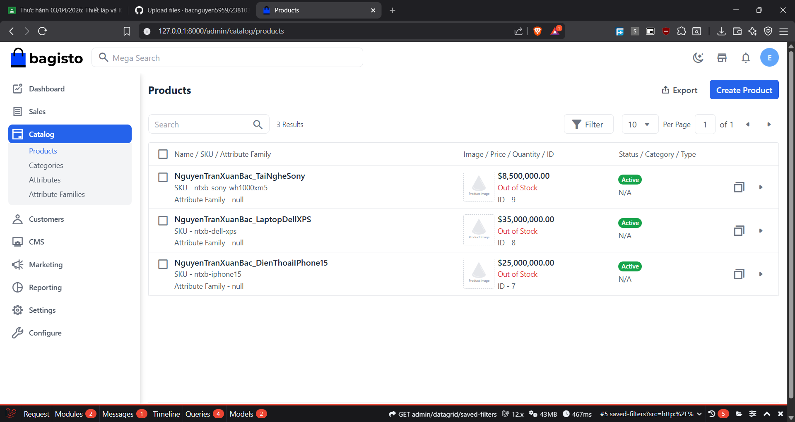
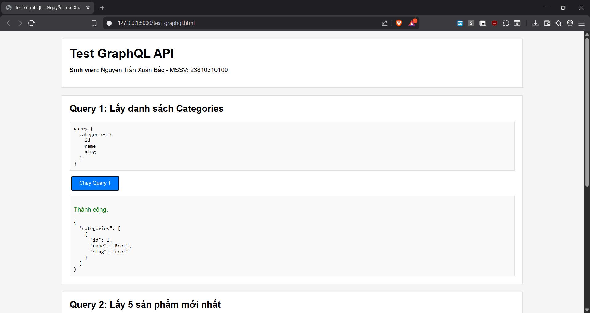
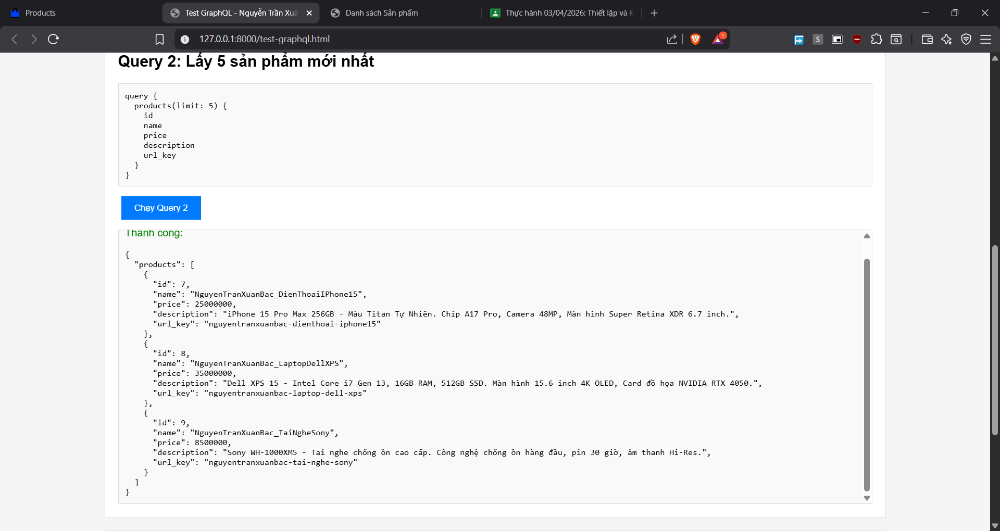
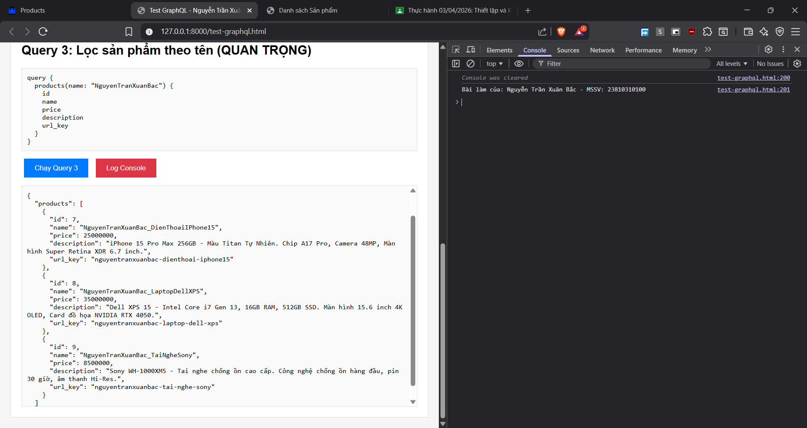
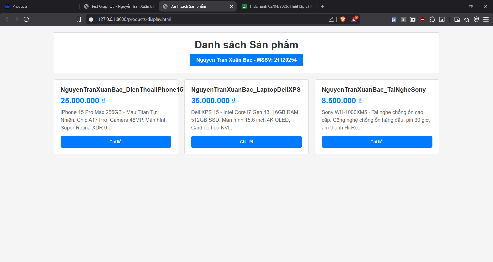

**Sinh viên:** Nguyễn Trần Xuân Bắc  
**MSSV:** 23810310100  
**Lớp:** D18CNPM2

### 1. Tạo 3 sản phẩm mẫu

Đã tạo 3 sản phẩm chứa tên của sinh viên

1. **NguyenTranXuanBac_DienThoaiIPhone15** - Giá: 25,000,000 VND
2. **NguyenTranXuanBac_LaptopDellXPS** - Giá: 35,000,000 VND
3. **NguyenTranXuanBac_TaiNgheSony** - Giá: 8,500,000 VND

#### Ảnh chụp màn hình Admin Panel




---

### 2. GraphQL API

#### 2.1. Query 1: Lấy danh sách Categories

```graphql
query {
  categories {
    id
    name
    slug
  }
}
```




---

#### 2.2. Query 2: Lấy 5 sản phẩm mới nhất

```graphql
query {
  products(limit: 5) {
    id
    name
    price
    description
    url_key
  }
}
```





---

#### 2.3. Query 3: Lọc sản phẩm theo tên sinh viên

```graphql
query {
  products(name: "NguyenTranXuanBac") {
    id
    name
    price
    description
    url_key
  }
}
```




---

### 3. Xây dựng Frontend đơn giản





---

## 4. CÂU HỎI BẮT BUỘC

### Câu 1: So sánh sự khác biệt về lưu lượng dữ liệu (Payload) giữa REST API và GraphQL

**Trả lời:**

REST API thường trả về toàn bộ dữ liệu của resource (over-fetching). Ví dụ, endpoint `/api/products` sẽ trả về tất cả các trường như id, name, price, description, images, categories, reviews, ratings, stock, variants, created_at, updated_at... dù client chỉ cần vài trường. Điều này làm tăng kích thước payload và băng thông, đặc biệt trên mobile.

GraphQL cho phép client chỉ định chính xác các trường cần thiết trong query. Trong bài làm của em, khi chỉ cần 5 trường (id, name, price, description, url_key), GraphQL chỉ trả về đúng 5 trường này. Điều này giảm đáng kể kích thước payload (có thể giảm 60-80% so với REST), tiết kiệm băng thông, giảm thời gian truyền tải và tăng tốc độ load trang.

---

### Câu 2: Thay đổi giá sản phẩm dùng Query hay Mutation?

**Trả lời:**

Em sẽ sử dụng **Mutation**.

Trong GraphQL, có sự phân biệt rõ ràng giữa Query và Mutation theo nguyên tắc CQRS (Command Query Responsibility Segregation):
- **Query**: Chỉ dùng để đọc dữ liệu (read-only operations), không thay đổi state của server
- **Mutation**: Dùng để thay đổi dữ liệu (write operations) như create, update, delete

Thay đổi giá sản phẩm là thao tác ghi (write operation) nên bắt buộc phải dùng Mutation.

Ví dụ:
```graphql
mutation {
  updateProductPrice(id: 1, price: 500000) {
    id
    name
    price
  }
}
```

Việc phân biệt này giúp code dễ hiểu, dễ maintain, tuân thủ best practices của GraphQL, và cho phép server tối ưu hóa caching cho Query.

---

